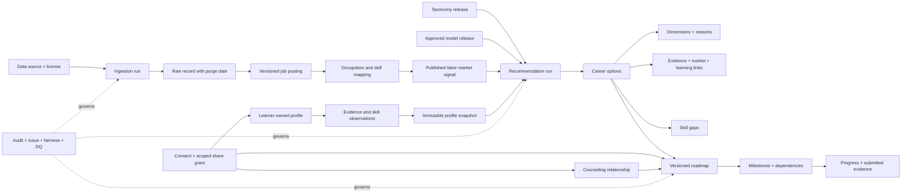
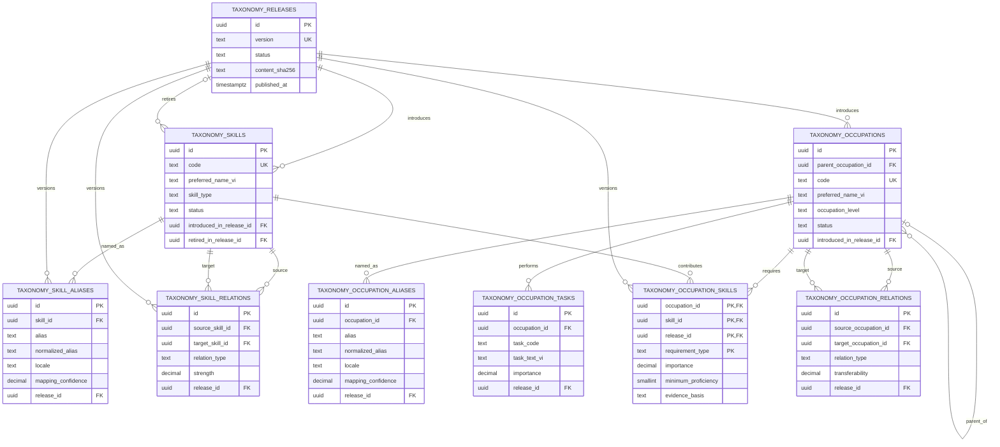
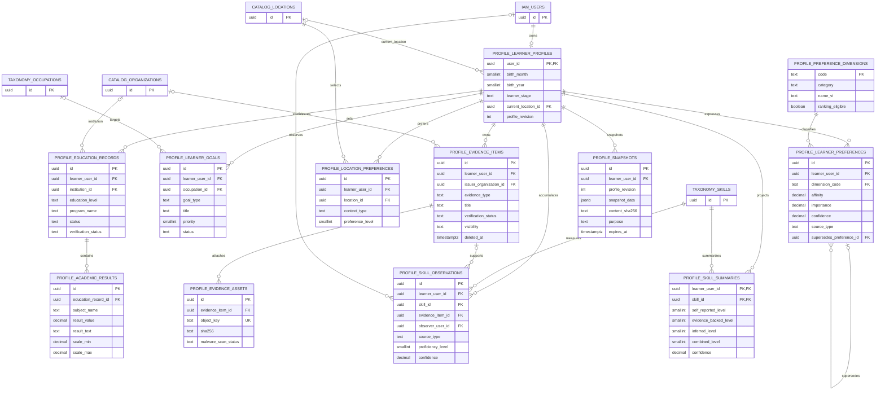
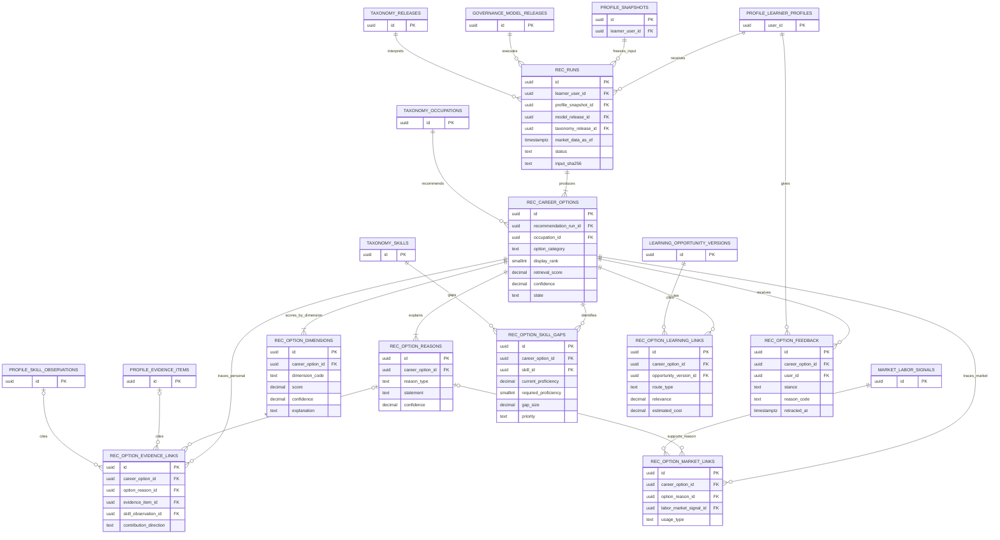
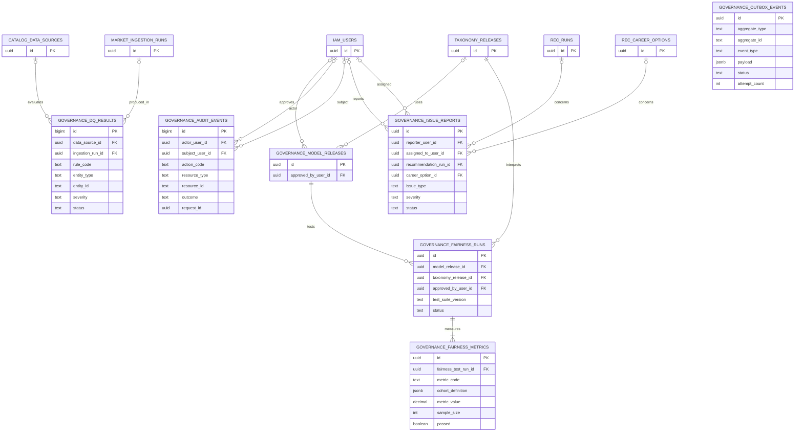

# ERD cơ sở dữ liệu MeshMind AI

## 1. Cách đọc

- Tên entity trong sơ đồ dùng `<SCHEMA>_<TABLE>` để Mermaid hiển thị ổn định.
- `||` là đúng một; `o|` là không hoặc một; `o{` là không hoặc nhiều; `|{` là một hoặc nhiều.
- ERD chỉ hiển thị khóa và field quan trọng. Kiểu/constraint đầy đủ nằm trong DDL và từ điển dữ liệu.
- Quan hệ `subject_type + subject_id` trong governance là controlled polymorphic reference nên không biểu diễn bằng FK.

## 2. Bản đồ lineage xuyên hệ thống

## 3. Catalog, IAM và privacy

```mermaid
erDiagram
    CATALOG_LOCATIONS {
      uuid id PK
      uuid parent_id FK
      char country_code
      smallint admin_level
      text code UK
      text name_vi
    }
    CATALOG_ORGANIZATIONS {
      uuid id PK
      uuid headquarters_location_id FK
      text organization_type
      text name
      text verification_status
    }
    CATALOG_DATA_SOURCES {
      uuid id PK
      uuid owner_organization_id FK
      text code UK
      text source_type
      text access_method
      int retention_days
      text status
    }
    IAM_USERS {
      uuid id PK
      text full_name
      text status
      text locale
      text time_zone
    }
    IAM_USER_EMAILS {
      uuid id PK
      uuid user_id FK
      text email
      text email_normalized UK
      boolean is_primary
      timestamptz verified_at
    }
    IAM_PASSWORD_CREDENTIALS {
      uuid user_id PK,FK
      text password_hash
      text hashing_algorithm
      int failed_attempt_count
      timestamptz locked_until
    }
    IAM_AUTH_SESSIONS {
      uuid id PK
      uuid user_id FK
      bytea token_hash UK
      timestamptz expires_at
      timestamptz revoked_at
    }
    IAM_ONE_TIME_TOKENS {
      uuid id PK
      uuid user_id FK
      uuid email_id FK
      text purpose
      bytea token_hash UK
      timestamptz expires_at
      timestamptz consumed_at
    }
    IAM_ROLES {
      text code PK
      text name
      boolean is_system_role
    }
    IAM_USER_ROLES {
      uuid user_id PK,FK
      text role_code PK,FK
      timestamptz granted_at PK
      uuid granted_by_user_id FK
      timestamptz expires_at
      timestamptz revoked_at
    }
    PRIVACY_CONSENT_PURPOSES {
      text code PK
      text legal_basis
      boolean is_required
      int default_retention_days
    }
    PRIVACY_POLICY_VERSIONS {
      uuid id PK
      text policy_type
      text version
      text locale
      text content_sha256
      text status
    }
    PRIVACY_CONSENT_RECORDS {
      uuid id PK
      uuid user_id FK
      text purpose_code FK
      uuid policy_version_id FK
      uuid actor_user_id FK
      uuid supersedes_record_id FK
      text decision
      timestamptz expires_at
    }
    PRIVACY_SHARE_GRANTS {
      uuid id PK
      uuid owner_user_id FK
      uuid recipient_user_id FK
      uuid consent_record_id FK
      text relationship_type
      text status
      timestamptz valid_until
    }
    PRIVACY_SHARE_GRANT_SCOPES {
      uuid share_grant_id PK,FK
      text scope_code PK
      text access_level
    }
    PRIVACY_GUARDIAN_RELATIONSHIPS {
      uuid id PK
      uuid learner_user_id FK
      uuid guardian_user_id FK
      text status
      timestamptz verified_at
    }
    PRIVACY_DATA_SUBJECT_REQUESTS {
      uuid id PK
      uuid user_id FK
      uuid assigned_to_user_id FK
      text request_type
      text status
      timestamptz due_at
    }
    PRIVACY_FAIRNESS_ATTRIBUTES {
      uuid id PK
      uuid user_id FK
      uuid consent_record_id FK
      text attribute_code
      bytea encrypted_value
      timestamptz expires_at
    }

    CATALOG_LOCATIONS o|--o{ CATALOG_LOCATIONS : parent_of
    CATALOG_LOCATIONS o|--o{ CATALOG_ORGANIZATIONS : headquarters
    CATALOG_ORGANIZATIONS o|--o{ CATALOG_DATA_SOURCES : owns

    IAM_USERS ||--o{ IAM_USER_EMAILS : has
    IAM_USERS ||--o| IAM_PASSWORD_CREDENTIALS : authenticates_with
    IAM_USERS ||--o{ IAM_AUTH_SESSIONS : opens
    IAM_USERS o|--o{ IAM_ONE_TIME_TOKENS : receives
    IAM_USER_EMAILS o|--o{ IAM_ONE_TIME_TOKENS : targets
    IAM_USERS ||--o{ IAM_USER_ROLES : assigned
    IAM_ROLES ||--o{ IAM_USER_ROLES : grants
    IAM_USERS o|--o{ IAM_USER_ROLES : granted_by

    IAM_USERS ||--o{ PRIVACY_CONSENT_RECORDS : decides
    PRIVACY_CONSENT_PURPOSES ||--o{ PRIVACY_CONSENT_RECORDS : covers
    PRIVACY_POLICY_VERSIONS ||--o{ PRIVACY_CONSENT_RECORDS : disclosed_by
    PRIVACY_CONSENT_RECORDS o|--o{ PRIVACY_CONSENT_RECORDS : supersedes
    PRIVACY_CONSENT_RECORDS ||--o{ PRIVACY_SHARE_GRANTS : authorizes
    IAM_USERS ||--o{ PRIVACY_SHARE_GRANTS : owns
    IAM_USERS ||--o{ PRIVACY_SHARE_GRANTS : receives
    PRIVACY_SHARE_GRANTS ||--|{ PRIVACY_SHARE_GRANT_SCOPES : limits
    IAM_USERS ||--o{ PRIVACY_GUARDIAN_RELATIONSHIPS : learner
    IAM_USERS ||--o{ PRIVACY_GUARDIAN_RELATIONSHIPS : guardian
    IAM_USERS ||--o{ PRIVACY_DATA_SUBJECT_REQUESTS : requests
    IAM_USERS ||--o{ PRIVACY_FAIRNESS_ATTRIBUTES : voluntarily_provides
    PRIVACY_CONSENT_RECORDS ||--o{ PRIVACY_FAIRNESS_ATTRIBUTES : permits
```

## 4. Taxonomy nghề–kỹ năng

## 5. Hồ sơ, bằng chứng và năng lực

## 6. Thị trường lao động, learning content và model registry

```mermaid
erDiagram
    CATALOG_DATA_SOURCES {
      uuid id PK
    }
    CATALOG_ORGANIZATIONS {
      uuid id PK
    }
    CATALOG_LOCATIONS {
      uuid id PK
    }
    TAXONOMY_RELEASES {
      uuid id PK
    }
    TAXONOMY_OCCUPATIONS {
      uuid id PK
    }
    TAXONOMY_SKILLS {
      uuid id PK
    }
    GOVERNANCE_MODEL_RELEASES {
      uuid id PK
      text model_type
      text model_name
      text model_version
      text prompt_version
      uuid taxonomy_release_id FK
      text status
    }
    MARKET_INGESTION_RUNS {
      uuid id PK
      uuid data_source_id FK
      text run_type
      text status
      int records_received
      int records_accepted
    }
    MARKET_RAW_RECORDS {
      bigint id PK
      uuid ingestion_run_id FK
      uuid data_source_id FK
      text external_id
      jsonb payload
      text payload_sha256
      text processing_status
      timestamptz purge_after
    }
    MARKET_JOB_POSTINGS {
      uuid id PK
      uuid data_source_id FK
      uuid employer_organization_id FK
      uuid duplicate_of_posting_id FK
      text external_id
      text status
    }
    MARKET_JOB_POSTING_VERSIONS {
      uuid id PK
      uuid job_posting_id FK
      uuid ingestion_run_id FK
      uuid location_id FK
      int version_number
      text content_sha256
      text salary_disclosure
      boolean is_current
    }
    MARKET_JOB_OCCUPATION_MAPPINGS {
      uuid id PK
      uuid job_posting_version_id FK
      uuid occupation_id FK
      uuid model_release_id FK
      text mapping_type
      decimal confidence
      text review_status
    }
    MARKET_JOB_SKILL_MENTIONS {
      uuid id PK
      uuid job_posting_version_id FK
      uuid skill_id FK
      uuid model_release_id FK
      text requirement_type
      decimal confidence
      text review_status
    }
    MARKET_JOB_QUALITY_FLAGS {
      uuid id PK
      uuid job_posting_version_id FK
      uuid model_release_id FK
      text flag_code
      text severity
      text status
    }
    MARKET_LABOR_SIGNALS {
      uuid id PK
      uuid occupation_id FK
      uuid skill_id FK
      uuid location_id FK
      date window_start
      date window_end
      int posting_count
      int supply_sample_size
      decimal confidence
      text status
    }
    MARKET_SIGNAL_SOURCE_STATS {
      uuid labor_market_signal_id PK,FK
      uuid data_source_id PK,FK
      int posting_count
      int accepted_posting_count
      decimal source_weight
    }
    LEARNING_OPPORTUNITIES {
      uuid id PK
      uuid provider_organization_id FK
      uuid data_source_id FK
      text opportunity_type
      text status
    }
    LEARNING_OPPORTUNITY_VERSIONS {
      uuid id PK
      uuid opportunity_id FK
      uuid location_id FK
      int version_number
      text title
      boolean is_sponsored
      text verification_status
      boolean is_current
    }
    LEARNING_OPPORTUNITY_SKILLS {
      uuid opportunity_version_id PK,FK
      uuid skill_id PK,FK
      text relation_type PK
      smallint target_proficiency
      decimal importance
    }
    LEARNING_OPPORTUNITY_OCCUPATIONS {
      uuid opportunity_version_id PK,FK
      uuid occupation_id PK,FK
      text relation_type PK
      decimal relevance
    }
    GOVERNANCE_DATA_QUALITY_RESULTS {
      bigint id PK
      uuid data_source_id FK
      uuid ingestion_run_id FK
      text rule_code
      text entity_type
      text entity_id
      text severity
      text status
    }

    TAXONOMY_RELEASES o|--o{ GOVERNANCE_MODEL_RELEASES : grounds
    CATALOG_DATA_SOURCES ||--o{ MARKET_INGESTION_RUNS : runs
    MARKET_INGESTION_RUNS ||--o{ MARKET_RAW_RECORDS : receives
    CATALOG_DATA_SOURCES ||--o{ MARKET_RAW_RECORDS : originates
    CATALOG_DATA_SOURCES ||--o{ MARKET_JOB_POSTINGS : publishes
    CATALOG_ORGANIZATIONS o|--o{ MARKET_JOB_POSTINGS : employer
    MARKET_JOB_POSTINGS o|--o{ MARKET_JOB_POSTINGS : duplicate_of
    MARKET_JOB_POSTINGS ||--|{ MARKET_JOB_POSTING_VERSIONS : versions
    MARKET_INGESTION_RUNS ||--o{ MARKET_JOB_POSTING_VERSIONS : captures
    CATALOG_LOCATIONS o|--o{ MARKET_JOB_POSTING_VERSIONS : located_in
    MARKET_JOB_POSTING_VERSIONS ||--o{ MARKET_JOB_OCCUPATION_MAPPINGS : maps
    TAXONOMY_OCCUPATIONS ||--o{ MARKET_JOB_OCCUPATION_MAPPINGS : normalizes
    GOVERNANCE_MODEL_RELEASES o|--o{ MARKET_JOB_OCCUPATION_MAPPINGS : produced_by
    MARKET_JOB_POSTING_VERSIONS ||--o{ MARKET_JOB_SKILL_MENTIONS : extracts
    TAXONOMY_SKILLS ||--o{ MARKET_JOB_SKILL_MENTIONS : normalizes
    GOVERNANCE_MODEL_RELEASES o|--o{ MARKET_JOB_SKILL_MENTIONS : produced_by
    MARKET_JOB_POSTING_VERSIONS ||--o{ MARKET_JOB_QUALITY_FLAGS : flagged
    GOVERNANCE_MODEL_RELEASES o|--o{ MARKET_JOB_QUALITY_FLAGS : detects
    TAXONOMY_OCCUPATIONS o|--o{ MARKET_LABOR_SIGNALS : dimension
    TAXONOMY_SKILLS o|--o{ MARKET_LABOR_SIGNALS : dimension
    CATALOG_LOCATIONS o|--o{ MARKET_LABOR_SIGNALS : dimension
    MARKET_LABOR_SIGNALS ||--|{ MARKET_SIGNAL_SOURCE_STATS : sourced_by
    CATALOG_DATA_SOURCES ||--o{ MARKET_SIGNAL_SOURCE_STATS : contributes

    CATALOG_ORGANIZATIONS o|--o{ LEARNING_OPPORTUNITIES : provides
    CATALOG_DATA_SOURCES o|--o{ LEARNING_OPPORTUNITIES : supplies
    LEARNING_OPPORTUNITIES ||--|{ LEARNING_OPPORTUNITY_VERSIONS : versions
    CATALOG_LOCATIONS o|--o{ LEARNING_OPPORTUNITY_VERSIONS : located_in
    LEARNING_OPPORTUNITY_VERSIONS ||--o{ LEARNING_OPPORTUNITY_SKILLS : teaches
    TAXONOMY_SKILLS ||--o{ LEARNING_OPPORTUNITY_SKILLS : maps
    LEARNING_OPPORTUNITY_VERSIONS ||--o{ LEARNING_OPPORTUNITY_OCCUPATIONS : prepares
    TAXONOMY_OCCUPATIONS ||--o{ LEARNING_OPPORTUNITY_OCCUPATIONS : maps

    MARKET_INGESTION_RUNS o|--o{ GOVERNANCE_DATA_QUALITY_RESULTS : evaluated_in
    CATALOG_DATA_SOURCES o|--o{ GOVERNANCE_DATA_QUALITY_RESULTS : evaluated_for
```

## 7. Recommendation và explainability

## 8. Roadmap và counseling

```mermaid
erDiagram
    PROFILE_LEARNER_PROFILES {
      uuid user_id PK
    }
    PROFILE_LEARNER_GOALS {
      uuid id PK
    }
    PROFILE_EVIDENCE_ITEMS {
      uuid id PK
    }
    IAM_USERS {
      uuid id PK
    }
    TAXONOMY_SKILLS {
      uuid id PK
    }
    GOVERNANCE_MODEL_RELEASES {
      uuid id PK
    }
    PRIVACY_SHARE_GRANTS {
      uuid id PK
    }
    REC_CAREER_OPTIONS {
      uuid id PK
    }
    ROADMAPS {
      uuid id PK
      uuid learner_user_id FK
      uuid learner_goal_id FK
      uuid source_career_option_id FK
      uuid current_version_id FK
      text primary_stage
      text status
    }
    ROADMAP_VERSIONS {
      uuid id PK
      uuid roadmap_id FK
      uuid based_on_version_id FK
      uuid authored_by_user_id FK
      uuid generated_by_model_release_id FK
      int version_number
      text authored_by_type
      text status
    }
    ROADMAP_MILESTONES {
      uuid id PK
      uuid roadmap_version_id FK
      uuid supersedes_milestone_id FK
      text stage
      text necessity
      date planned_due_on
      text completion_criteria
      int sort_order
    }
    ROADMAP_DEPENDENCIES {
      uuid milestone_id PK,FK
      uuid depends_on_milestone_id PK,FK
      text dependency_type
    }
    ROADMAP_MILESTONE_SKILLS {
      uuid milestone_id PK,FK
      uuid skill_id PK,FK
      text purpose PK
      smallint target_proficiency
    }
    ROADMAP_EVIDENCE_REQUIREMENTS {
      uuid id PK
      uuid milestone_id FK
      text evidence_type
      text requirement_text
      int minimum_count
      jsonb rubric
    }
    ROADMAP_PROGRESS_EVENTS {
      uuid id PK
      uuid roadmap_id FK
      uuid milestone_id FK
      uuid actor_user_id FK
      text status
      decimal completion_percent
      timestamptz occurred_at
    }
    ROADMAP_MILESTONE_EVIDENCE {
      uuid milestone_id PK,FK
      uuid evidence_item_id PK,FK
      uuid reviewed_by_user_id FK
      text review_status
    }
    COUNSELING_RELATIONSHIPS {
      uuid id PK
      uuid learner_user_id FK
      uuid counselor_user_id FK
      uuid share_grant_id FK
      text status
    }
    COUNSELING_APPOINTMENTS {
      uuid id PK
      uuid relationship_id FK
      timestamptz scheduled_start_at
      timestamptz scheduled_end_at
      text status
    }
    COUNSELING_SESSION_NOTES {
      uuid id PK
      uuid appointment_id FK
      uuid author_user_id FK
      text visibility
      text note_text
    }
    COUNSELING_ACTION_ITEMS {
      uuid id PK
      uuid appointment_id FK
      uuid roadmap_id FK
      uuid milestone_id FK
      uuid assignee_user_id FK
      text status
    }
    COUNSELING_REC_REVIEWS {
      uuid id PK
      uuid relationship_id FK
      uuid career_option_id FK
      uuid reviewer_user_id FK
      text review_outcome
    }

    PROFILE_LEARNER_PROFILES ||--o{ ROADMAPS : owns
    PROFILE_LEARNER_GOALS o|--o{ ROADMAPS : realizes
    REC_CAREER_OPTIONS o|--o{ ROADMAPS : starts_from
    ROADMAPS ||--|{ ROADMAP_VERSIONS : versions
    ROADMAP_VERSIONS o|--o{ ROADMAP_VERSIONS : based_on
    IAM_USERS o|--o{ ROADMAP_VERSIONS : authors
    GOVERNANCE_MODEL_RELEASES o|--o{ ROADMAP_VERSIONS : generates
    ROADMAPS o|--o| ROADMAP_VERSIONS : current
    ROADMAP_VERSIONS ||--|{ ROADMAP_MILESTONES : contains
    ROADMAP_MILESTONES o|--o{ ROADMAP_MILESTONES : supersedes
    ROADMAP_MILESTONES ||--o{ ROADMAP_DEPENDENCIES : dependent
    ROADMAP_MILESTONES ||--o{ ROADMAP_DEPENDENCIES : prerequisite
    ROADMAP_MILESTONES ||--o{ ROADMAP_MILESTONE_SKILLS : develops
    TAXONOMY_SKILLS ||--o{ ROADMAP_MILESTONE_SKILLS : targeted
    ROADMAP_MILESTONES ||--o{ ROADMAP_EVIDENCE_REQUIREMENTS : requires
    ROADMAPS ||--o{ ROADMAP_PROGRESS_EVENTS : tracks
    ROADMAP_MILESTONES ||--o{ ROADMAP_PROGRESS_EVENTS : updates
    IAM_USERS o|--o{ ROADMAP_PROGRESS_EVENTS : records
    ROADMAP_MILESTONES ||--o{ ROADMAP_MILESTONE_EVIDENCE : receives
    PROFILE_EVIDENCE_ITEMS ||--o{ ROADMAP_MILESTONE_EVIDENCE : submitted

    PROFILE_LEARNER_PROFILES ||--o{ COUNSELING_RELATIONSHIPS : learner
    IAM_USERS ||--o{ COUNSELING_RELATIONSHIPS : counselor
    PRIVACY_SHARE_GRANTS ||--o| COUNSELING_RELATIONSHIPS : authorizes
    COUNSELING_RELATIONSHIPS ||--o{ COUNSELING_APPOINTMENTS : schedules
    COUNSELING_APPOINTMENTS ||--o{ COUNSELING_SESSION_NOTES : records
    IAM_USERS ||--o{ COUNSELING_SESSION_NOTES : authors
    COUNSELING_APPOINTMENTS ||--o{ COUNSELING_ACTION_ITEMS : creates
    ROADMAPS o|--o{ COUNSELING_ACTION_ITEMS : relates
    ROADMAP_MILESTONES o|--o{ COUNSELING_ACTION_ITEMS : relates
    COUNSELING_RELATIONSHIPS ||--o{ COUNSELING_REC_REVIEWS : reviews
    REC_CAREER_OPTIONS ||--o{ COUNSELING_REC_REVIEWS : subject
```

## 9. Governance và operational events

`governance.outbox_events` không có FK đến aggregate vì phải phát event cho nhiều miền và giữ event ngay cả khi aggregate được purge. `aggregate_type` được quản lý bằng contract sự kiện/version, không dùng để join nghiệp vụ thường xuyên.
