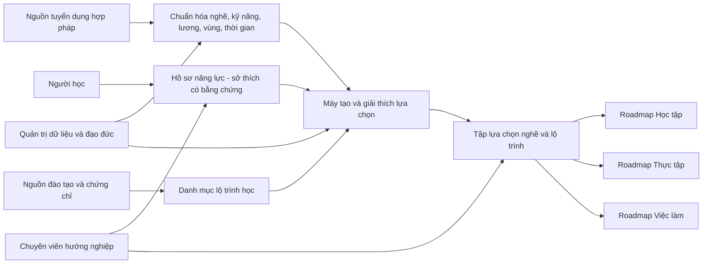

# Phân tích Mục tiêu, Phạm vi, Tác nhân và Chức năng

## Hệ thống AI định hướng học tập và nghề nghiệp theo năng lực, sở thích và nhu cầu thị trường lao động

> **Trạng thái:** Bản phân tích ý tưởng ban đầu  
> **Đối tượng sử dụng tài liệu:** Nhóm sản phẩm, nhóm dữ liệu/AI, nhóm phát triển phần mềm, chuyên viên hướng nghiệp và hội đồng đánh giá  
> **Nguyên tắc trung tâm:** Hệ thống mở rộng lựa chọn và cung cấp bằng chứng tham khảo; không quyết định thay người học.

---

## 1. Tóm tắt bài toán và ý tưởng giải pháp

### 1.1. Bài toán

Nhiều học sinh, sinh viên Việt Nam lựa chọn ngành học và nghề nghiệp dựa chủ yếu vào cảm tính, xu hướng nhất thời hoặc kỳ vọng của gia đình. Điều này góp phần tạo ra ba vấn đề:

- Cung nhân lực ở một số ngành vượt quá nhu cầu trong khi nhiều vị trí kỹ thuật, nghề và kỹ năng chuyên môn lại thiếu người.
- Người học khó tìm được việc phù hợp sau tốt nghiệp hoặc phải làm công việc không liên quan đến chuyên môn.
- Chương trình học, kỹ năng thực tế và nhu cầu tuyển dụng thay đổi nhanh nhưng chưa được kết nối thành một lộ trình cá nhân hóa.

Các công cụ hướng nghiệp thông thường thường dừng ở một bài trắc nghiệm tính cách hoặc danh sách nghề nghiệp tổng quát. Chúng chưa kết hợp đầy đủ bằng chứng về năng lực của từng người với tín hiệu tuyển dụng thực tế theo kỹ năng, mức lương, khu vực và thời gian.

### 1.2. Ý tưởng giải pháp

Xây dựng một hệ thống hỗ trợ ra quyết định hướng nghiệp sử dụng AI để:

1. Phân tích dữ liệu tuyển dụng nhằm nhận diện nghề đang tăng trưởng, kỹ năng đang thiếu, mức lương tham khảo và khác biệt nhu cầu giữa các khu vực/thời điểm.
2. Xây dựng hồ sơ năng lực – sở thích của người học qua nhiều lần tương tác và nhiều loại bằng chứng, không rút gọn con người thành kết quả của một bài trắc nghiệm tính cách.
3. Đề xuất một **tập hợp lựa chọn** nghề nghiệp và con đường đào tạo có giải thích, bao gồm đại học, cao đẳng, trung cấp, học nghề, chứng chỉ, tự học và lộ trình kết hợp.
4. Tạo roadmap có thể hành động qua ba giai đoạn:
   - **Học tập:** chọn nhóm ngành/nghề, môn học, kỹ năng, chứng chỉ, dự án, nghiên cứu khoa học, hoạt động ngoại khóa và cuộc thi.
   - **Thực tập:** chọn vai trò/môi trường thực tập, hoàn thiện CV và portfolio, áp dụng kiến thức, bù khoảng trống kỹ năng và chuẩn bị phỏng vấn.
   - **Việc làm chính thức:** so sánh vai trò dựa trên nội dung công việc, lương, phúc lợi và điều kiện; xác định kỹ năng và cột mốc để phát triển lên vị trí cao hơn.

Hệ thống không trả lời “Bạn phải làm nghề gì?”, mà trả lời “Đây là những lựa chọn đáng cân nhắc, lý do, bằng chứng, đánh đổi và các bước để bạn tự quyết định”.

---

## 2. Mục tiêu

### 2.1. Tầm nhìn sản phẩm

Mỗi học sinh, sinh viên có thể tiếp cận một chuyên gia đồng hành hướng nghiệp dựa trên dữ liệu, hiểu bối cảnh cá nhân, giải thích được đề xuất và giúp biến lựa chọn nghề nghiệp thành một kế hoạch học tập – trải nghiệm – việc làm cụ thể.

### 2.2. Mục tiêu cốt lõi

| Mã | Mục tiêu | Kết quả mong muốn |
|---|---|---|
| MT-01 | Biến dữ liệu tuyển dụng thành tín hiệu kỹ năng có giá trị | Người dùng biết nghề/kỹ năng nào đang tăng hoặc giảm, thiếu ở đâu, mức lương tham khảo và độ tin cậy của dữ liệu |
| MT-02 | Hiểu người học theo nhiều chiều và theo thời gian | Hồ sơ phản ánh học vấn, kỹ năng có bằng chứng, sở thích, giá trị công việc, hoạt động, điều kiện và phản hồi trong quá trình sử dụng |
| MT-03 | Cá nhân hóa nhưng không đóng khung | Mỗi người nhận được nhiều lựa chọn phù hợp, lựa chọn liền kề và lựa chọn vươn tới, thay vì một “nghề lý tưởng” duy nhất |
| MT-04 | Giải thích được mọi đề xuất quan trọng | Người học hiểu yếu tố cá nhân nào, tín hiệu thị trường nào và khoảng trống nào dẫn đến đề xuất |
| MT-05 | Chuyển gợi ý thành hành động | Mỗi lựa chọn có roadmap Học tập → Thực tập → Việc làm với cột mốc, điều kiện tiên quyết, thời gian và cách kiểm chứng tiến bộ |
| MT-06 | Bao quát cả giáo dục nghề nghiệp | Các lộ trình cao đẳng, trung cấp, học nghề, chứng chỉ và học qua dự án được xem là lựa chọn bình đẳng, không phải phương án “thấp hơn” đại học |
| MT-07 | Mở rộng cơ hội và bảo vệ quyền tự chủ | Giới tính, quê quán hoặc định kiến xã hội không được dùng để suy diễn mức độ phù hợp; người học luôn có quyền sửa dữ liệu, thay mục tiêu và từ chối đề xuất |
| MT-08 | Hỗ trợ chuyên viên hướng nghiệp | Chuyên viên có bằng chứng và công cụ so sánh để tư vấn tốt hơn, nhưng không bị AI thay thế trong các quyết định cần thấu cảm và bối cảnh sâu |

### 2.3. Mục tiêu đạo đức bắt buộc

1. **Mở rộng thay vì thu hẹp lựa chọn:** hệ thống phải đưa ra nhiều phương án và chỉ ra cách người học có thể tiếp cận một nghề nếu hiện tại còn thiếu kỹ năng.
2. **Không dùng thuộc tính được bảo vệ để xếp hạng độ phù hợp:** giới tính, dân tộc, tôn giáo, tình trạng hôn nhân và quê quán không được làm tăng/giảm điểm phù hợp nghề nghiệp.
3. **Không biến khu vực thành định kiến năng lực:** khu vực chỉ được dùng để mô tả nhu cầu, chi phí hoặc khả năng tiếp cận cơ hội; không được dùng để kết luận người ở khu vực đó có năng lực thấp/cao hơn.
4. **Tôn trọng quyền tự quyết:** mọi kết quả phải được gắn nhãn là thông tin tham khảo; người dùng có thể điều chỉnh ưu tiên, xem phương án khác và tự đưa ra quyết định cuối cùng.
5. **Minh bạch bằng chứng và bất định:** hiển thị nguồn, thời điểm cập nhật, cỡ mẫu, phạm vi dữ liệu và mức tin cậy; không trình bày dự báo hoặc lương ước tính như sự thật chắc chắn.
6. **Thu thập dữ liệu tối thiểu:** chỉ yêu cầu dữ liệu cần thiết, có mục đích rõ ràng; cho phép xem, sửa, tải xuống và xóa dữ liệu cá nhân.
7. **Con người giám sát:** các trường hợp rủi ro cao, dữ liệu mâu thuẫn hoặc có dấu hiệu thiên lệch cần được chuyển cho chuyên viên/nhóm quản trị xem xét.

### 2.4. Mục tiêu đo lường đề xuất

Các ngưỡng dưới đây là mục tiêu ban đầu cho MVP và cần được hiệu chỉnh sau pilot:

| Nhóm đánh giá | Chỉ số đề xuất |
|---|---|
| Trích xuất tín hiệu kỹ năng | F1 trích xuất kỹ năng trên tập dữ liệu gán nhãn tiếng Việt ≥ 0,85; tỷ lệ tin được chuẩn hóa nghề/kỹ năng ≥ 90%; nguồn và ngày thu thập xuất hiện ở 100% insight |
| Cá nhân hóa | ≥ 80% người dùng thử nghiệm cho rằng ít nhất 3 lựa chọn “đáng để tìm hiểu”; chuyên viên đánh giá hồ sơ phản ánh đúng bối cảnh ở ≥ 80% phiên thử nghiệm |
| Giải thích | 100% đề xuất nghề có lý do cá nhân, bằng chứng thị trường, khoảng trống kỹ năng và mức tin cậy; ≥ 80% người dùng hiểu vì sao lựa chọn được đề xuất |
| Mở rộng cơ hội | Khi dữ liệu cho phép, mỗi kết quả có lựa chọn phù hợp hiện tại, lựa chọn liền kề và lựa chọn vươn tới; thay đổi riêng giới tính không được làm thay đổi xếp hạng |
| Hữu ích thực tế | ≥ 70% người dùng hoàn thành ít nhất một hành động trong roadmap; ≥ 80% chuyên viên thử nghiệm đánh giá hệ thống hữu ích cho một buổi tư vấn |
| Tính mới của dữ liệu | Hiển thị độ trễ dữ liệu; mục tiêu cập nhật dữ liệu tuyển dụng không quá 7 ngày đối với nguồn hoạt động thường xuyên |

### 2.5. Các mục tiêu không theo đuổi

Hệ thống **không** nhằm:

- Quyết định thay người học hoặc khẳng định một nghề duy nhất là “đúng”.
- Đảm bảo trúng tuyển, có việc làm, mức lương hoặc thăng tiến.
- Chẩn đoán tâm lý, trí tuệ, năng lực bẩm sinh hoặc sức khỏe tâm thần.
- Tự động loại người học khỏi một nghề vì điểm thấp, thiếu chứng chỉ, điều kiện tài chính, giới tính hoặc nơi sinh sống.
- Thay thế chuyên viên hướng nghiệp, giáo viên, phụ huynh hoặc trải nghiệm thực tế.
- Xếp hạng trường/cơ sở đào tạo chỉ dựa trên độ nổi tiếng hoặc nội dung quảng cáo.
- Thu thập dữ liệu tuyển dụng trái điều khoản sử dụng, vi phạm quyền riêng tư hoặc quyền sở hữu dữ liệu.

---

## 3. Phạm vi

### 3.1. Đối tượng phục vụ chính

- Học sinh THCS cuối cấp đang khám phá nhóm nghề và lựa chọn THPT/giáo dục nghề nghiệp.
- Học sinh THPT đang chọn tổ hợp môn, ngành, cơ sở đào tạo hoặc con đường học nghề.
- Sinh viên/học viên nghề đang chọn chuyên môn, bổ sung kỹ năng, tìm thực tập hoặc chuẩn bị việc làm.
- Người mới tốt nghiệp muốn tìm vai trò đầu tiên hoặc điều chỉnh hướng đi sớm trong sự nghiệp.
- Chuyên viên hướng nghiệp tại trường, trung tâm hoặc tổ chức hỗ trợ thanh niên.

### 3.2. Ranh giới hệ thống



Hệ thống tạo khuyến nghị dựa trên ba nhóm bằng chứng độc lập nhưng có liên kết:

- **Bằng chứng cá nhân:** người học đã làm gì, thích gì, thể hiện năng lực ra sao và muốn điều kiện công việc như thế nào.
- **Bằng chứng thị trường:** nhà tuyển dụng đang cần vai trò/kỹ năng nào, ở đâu, khi nào và với mức lương được đăng như thế nào.
- **Bằng chứng lộ trình:** để đi từ hiện trạng đến mục tiêu cần học, luyện tập và chứng minh năng lực qua những bước nào.

### 3.3. Dữ liệu đầu vào trong phạm vi

#### A. Dữ liệu do người học cung cấp

- Học vấn: cấp học, ngành hiện tại, điểm môn học, môn yêu thích/không yêu thích.
- Minh chứng năng lực: bài tập, dự án, portfolio, nghiên cứu khoa học, giải thưởng, sản phẩm hoặc kinh nghiệm thực hành.
- Kỹ năng tự khai báo và mức tự tin, kèm tùy chọn kiểm chứng qua hoạt động ngắn.
- Kết quả trắc nghiệm tính cách/sở thích nghề nghiệp; đây chỉ là một tín hiệu, không phải kết luận.
- Hoạt động ngoại khóa, câu lạc bộ, tình nguyện, vai trò lãnh đạo và cuộc thi.
- Chứng chỉ, khóa học đã hoàn thành và ngôn ngữ sử dụng.
- Sở thích, chủ đề tò mò, loại nhiệm vụ yêu thích và môi trường làm việc mong muốn.
- Giá trị nghề nghiệp: thu nhập, ổn định, sáng tạo, tác động xã hội, cân bằng cuộc sống, mức tự chủ, làm việc nhóm.
- Điều kiện và ưu tiên: ngân sách, thời gian, khả năng di chuyển, học trực tiếp/từ xa, nhu cầu hỗ trợ tiếp cận.
- Phản hồi trong quá trình sử dụng: thích/không thích một lựa chọn, lý do từ chối, mức sẵn sàng và hành động đã hoàn thành.

#### B. Dữ liệu thị trường lao động

- Tin tuyển dụng từ nguồn được cấp phép, nguồn mở hợp pháp hoặc nguồn do đối tác cung cấp.
- Tên vai trò, mô tả công việc, kỹ năng bắt buộc/ưu tiên, kinh nghiệm, học vấn và chứng chỉ.
- Mức lương đăng tuyển, loại hợp đồng, phúc lợi nếu có, hình thức làm việc và khu vực.
- Ngày đăng, thời gian tồn tại của tin và lịch sử thay đổi để phân tích xu hướng.
- Dữ liệu đã khử trùng lặp và gắn cờ tin thiếu, bất thường, có nguy cơ lừa đảo hoặc chất lượng thấp.

#### C. Dữ liệu học tập và phát triển nghề nghiệp

- Ngành/chương trình đào tạo, môn học, kỹ năng đầu ra, điều kiện đầu vào và thời lượng.
- Khóa học, chứng chỉ, dự án thực hành, hoạt động nghiên cứu, cuộc thi và cơ hội thực tập.
- Nguồn phải có thông tin cập nhật, phạm vi áp dụng và điều kiện tham gia; nội dung quảng cáo không được xem là bằng chứng chất lượng nếu chưa kiểm chứng.

### 3.4. Chức năng nằm trong phạm vi

1. Thu thập, làm sạch, chuẩn hóa và phân tích dữ liệu tuyển dụng.
2. Xây dựng taxonomy/ontology liên kết nghề – nhiệm vụ – kỹ năng – chương trình học – chứng chỉ.
3. Tạo hồ sơ người học đa chiều, có bằng chứng và cập nhật theo thời gian.
4. Sinh nhiều lựa chọn nghề/lộ trình, có so sánh và giải thích.
5. Tạo roadmap Học tập → Thực tập → Việc làm cho từng mục tiêu.
6. Hỗ trợ chuyên viên xem hồ sơ, thảo luận phương án và ghi chú với sự đồng ý của người học.
7. Theo dõi phản hồi, tiến độ và điều chỉnh roadmap.
8. Kiểm soát quyền riêng tư, chất lượng dữ liệu, thiên lệch và lịch sử quyết định của hệ thống.

### 3.5. Ngoài phạm vi MVP

- Cổng tuyển dụng hoàn chỉnh hoặc tự động nộp hồ sơ hàng loạt.
- Tự động tuyển sinh, xét tuyển, cho vay học phí hoặc quyết định học bổng.
- Tư vấn pháp lý, y tế hoặc chẩn đoán tâm lý.
- Cam kết chính xác tuyệt đối về xu hướng tương lai, lương hoặc khả năng có việc.
- Chấm điểm ứng viên để cung cấp cho nhà tuyển dụng.
- Mạng xã hội, nhắn tin công khai giữa mọi người dùng hoặc marketplace khóa học trả phí.
- Đánh giá chất lượng toàn bộ cơ sở giáo dục Việt Nam khi chưa có dữ liệu kiểm chứng phù hợp.

### 3.6. Phân kỳ phạm vi

| Giai đoạn | Phạm vi |
|---|---|
| MVP | Một tập nguồn tuyển dụng hợp pháp; một số nhóm nghề đại diện; chuẩn hóa kỹ năng; hồ sơ đa chiều; 3 nhóm lựa chọn; giải thích; roadmap cơ bản; màn hình chuyên viên; consent và audit log |
| Pilot | Mở rộng khu vực/nghề; kiểm chứng hồ sơ bằng mini-task; so sánh lộ trình đại học và nghề; theo dõi tiến độ; đánh giá cùng học sinh và chuyên viên |
| Mở rộng | Dự báo xu hướng có khoảng tin cậy; mô phỏng kịch bản; hệ sinh thái đối tác đào tạo/thực tập; cá nhân hóa dài hạn; đánh giá fairness định kỳ trên quy mô lớn |

---

## 4. Các tác nhân

### 4.1. Tác nhân chính

| Tác nhân | Mục tiêu khi sử dụng | Quyền và tương tác chính | Giới hạn/bảo vệ |
|---|---|---|---|
| **Người học** | Hiểu bản thân, khám phá nghề, so sánh lộ trình và thực hiện roadmap | Tạo/sửa hồ sơ; chọn mục tiêu; xem, so sánh, phản hồi đề xuất; quản lý quyền chia sẻ; xóa/xuất dữ liệu | Luôn là chủ thể quyết định; không bị ẩn lựa chọn chỉ vì hồ sơ hiện tại chưa mạnh |
| **Chuyên viên hướng nghiệp** | Chuẩn bị và thực hiện buổi tư vấn dựa trên bằng chứng | Xem dữ liệu được chia sẻ; cùng người học điều chỉnh ưu tiên; ghi chú; tạo phiên bản roadmap; đánh dấu đề xuất cần xem xét | Chỉ truy cập khi có quyền; không được xem thuộc tính nhạy cảm không cần thiết; hành động phải có log |

### 4.2. Tác nhân vận hành

| Tác nhân | Trách nhiệm | Quyền chính | Giới hạn/bảo vệ |
|---|---|---|---|
| **Chuyên viên dữ liệu thị trường lao động** | Quản lý nguồn, taxonomy, chất lượng trích xuất và insight xu hướng | Cấu hình pipeline; xem dữ liệu lỗi; duyệt mapping nghề/kỹ năng; phát hành phiên bản dữ liệu | Không truy cập danh tính người học nếu không cần thiết |
| **Quản trị nội dung/lộ trình** | Kiểm chứng thông tin đào tạo, chứng chỉ, cuộc thi, hoạt động và mẫu roadmap | Thêm, sửa, hết hạn hoặc gắn cờ nội dung; quản lý điều kiện tiên quyết | Không được ưu tiên nội dung tài trợ nếu không công khai; mọi thay đổi có nguồn và phiên bản |
| **Quản trị hệ thống** | Vận hành tài khoản, phân quyền, bảo mật và tính sẵn sàng | Quản lý vai trò; xử lý sự cố; cấu hình lưu trữ; xem log kỹ thuật | Áp dụng quyền tối thiểu; không tự ý xem nội dung hồ sơ cá nhân |
| **Người phụ trách đạo đức/kiểm toán** | Theo dõi thiên lệch, quyền riêng tư, khả năng giải thích và khiếu nại | Chạy bộ kiểm thử fairness; xem log đã khử định danh; tạm dừng phiên bản mô hình; xử lý báo cáo | Dữ liệu nhạy cảm chỉ dùng có consent cho đánh giá tổng hợp, không đưa vào xếp hạng cá nhân |

### 4.3. Tác nhân/hệ thống bên ngoài

| Tác nhân/hệ thống | Vai trò trong hệ sinh thái | Cách tương tác dự kiến |
|---|---|---|
| **Nguồn dữ liệu tuyển dụng/nhà tuyển dụng đối tác** | Cung cấp tin tuyển dụng và tín hiệu nhu cầu | API, file định kỳ hoặc feed được cấp phép; không nhận hồ sơ cá nhân trong MVP |
| **Cơ sở giáo dục/đơn vị đào tạo/chứng chỉ** | Cung cấp thông tin chương trình và điều kiện tham gia | API, feed hoặc nội dung đã được quản trị viên kiểm chứng |
| **Dịch vụ xác thực/thông báo** | Đăng nhập và gửi nhắc việc | Chỉ nhận dữ liệu tối thiểu cần thiết; tuân thủ lựa chọn nhận thông báo |
| **Phụ huynh/người hỗ trợ** | Đồng hành khi người học chủ động chia sẻ | Chỉ xem bản tóm tắt hoặc roadmap được người học cho phép; không được thay đổi quyết định thay người học |

### 4.4. Ma trận trách nhiệm rút gọn

| Hoạt động | Người học | Chuyên viên | Dữ liệu/Nội dung | Đạo đức | Hệ thống |
|---|---:|---:|---:|---:|---:|
| Cung cấp và xác nhận hồ sơ cá nhân | Chủ trì | Hỗ trợ | — | Kiểm tra chính sách | Gợi ý/kiểm tra thiếu dữ liệu |
| Chuẩn hóa tín hiệu tuyển dụng | — | Tham khảo | Chủ trì | Kiểm toán | Tự động xử lý |
| Chọn ưu tiên và mục tiêu | Quyết định | Hỗ trợ | — | — | Mô phỏng phương án |
| Tạo đề xuất và roadmap | Phản hồi | Đồng biên tập | Cung cấp dữ liệu chuẩn | Đặt guardrail | Sinh và giải thích |
| Phát hiện thiên lệch | Báo cáo | Báo cáo | Hỗ trợ dữ liệu | Chủ trì | Theo dõi/chặn |
| Quyết định nghề/lộ trình cuối cùng | **Quyết định** | Tư vấn | — | — | Không có quyền quyết định |

---

## 5. Chức năng hệ thống

### 5.1. Nhóm A — Quản lý tài khoản, consent và dữ liệu cá nhân

| Mã | Chức năng | Yêu cầu/tiêu chí chính | Ưu tiên |
|---|---|---|---|
| FN-A01 | Onboarding theo mục tiêu | Hỏi người dùng đang khám phá nghề, chọn ngành, tìm thực tập hay tìm việc; cho phép bỏ qua câu hỏi chưa muốn trả lời | P0 |
| FN-A02 | Quản lý consent | Giải thích dữ liệu nào được thu thập, dùng để làm gì, giữ bao lâu và chia sẻ với ai; lưu phiên bản consent | P0 |
| FN-A03 | Quản lý hồ sơ | Người học có thể xem, sửa, bổ sung, tải xuống và yêu cầu xóa dữ liệu | P0 |
| FN-A04 | Chia sẻ có kiểm soát | Người học chọn phần dữ liệu và thời hạn chia sẻ với chuyên viên/phụ huynh | P0 |
| FN-A05 | Nhật ký truy cập | Ghi ai đã xem hoặc thay đổi hồ sơ/roadmap và thời điểm thực hiện | P0 |
| FN-A06 | Bảo vệ người dùng vị thành niên | Áp dụng luồng consent, quyền truy cập và ngôn ngữ phù hợp độ tuổi theo chính sách được phê duyệt | P0 |

### 5.2. Nhóm B — Phân tích tín hiệu thị trường lao động

| Mã | Chức năng | Yêu cầu/tiêu chí chính | Ưu tiên |
|---|---|---|---|
| FN-B01 | Tiếp nhận dữ liệu tuyển dụng | Hỗ trợ API/feed/file từ nguồn hợp pháp; lưu nguồn, thời điểm và điều kiện sử dụng | P0 |
| FN-B02 | Làm sạch và khử trùng lặp | Phát hiện tin đăng lại, cùng một vị trí trên nhiều nguồn, dữ liệu thiếu hoặc bất thường | P0 |
| FN-B03 | Chuẩn hóa nghề/vai trò | Ánh xạ biến thể tên việc làm tiếng Việt/Anh về taxonomy; lưu độ tin cậy và cho phép duyệt thủ công | P0 |
| FN-B04 | Trích xuất kỹ năng | Phân biệt kỹ năng bắt buộc, ưu tiên, công cụ, kiến thức miền, kỹ năng mềm, chứng chỉ và số năm kinh nghiệm | P0 |
| FN-B05 | Chuẩn hóa mức lương | Chuẩn hóa đơn vị, chu kỳ, tiền tệ và khoảng lương; tách lương đăng tuyển khỏi lương ước tính | P0 |
| FN-B06 | Phân tích theo vùng và thời gian | Thống kê nhu cầu nghề/kỹ năng, tốc độ thay đổi, mùa vụ và phân bố theo khu vực/hình thức làm việc | P0 |
| FN-B07 | Phát hiện kỹ năng thiếu hụt | So sánh nhu cầu, tốc độ tăng và mức độ phổ biến nguồn cung khi có dữ liệu đáng tin; không tuyên bố “thiếu” nếu chỉ có số tin đăng | P1 |
| FN-B08 | Tạo insight có nguồn | Mọi insight hiển thị nguồn, khoảng thời gian, cỡ mẫu, phương pháp, độ phủ và mức tin cậy | P0 |
| FN-B09 | Cảnh báo chất lượng | Gắn cờ mẫu quá nhỏ, tin bất thường/lừa đảo, lương ngoại lệ và thay đổi có thể do nguồn dữ liệu | P0 |
| FN-B10 | Phiên bản hóa dữ liệu | Có thể tái tạo insight/đề xuất theo phiên bản taxonomy, dữ liệu và mô hình đã sử dụng | P0 |

### 5.3. Nhóm C — Xây dựng hồ sơ năng lực – sở thích qua tương tác

| Mã | Chức năng | Yêu cầu/tiêu chí chính | Ưu tiên |
|---|---|---|---|
| FN-C01 | Nhập dữ liệu học vấn | Nhập điểm, môn học, ngành hiện tại, dự án, nghiên cứu và thành tích; cho phép khai báo “chưa có” | P0 |
| FN-C02 | Nhập hoạt động và chứng chỉ | Ghi vai trò, mức tham gia, kết quả và kỹ năng được thể hiện thay vì chỉ ghi tên hoạt động | P0 |
| FN-C03 | Khám phá sở thích qua hội thoại | Dùng câu hỏi tình huống, lựa chọn nhiệm vụ, chủ đề tò mò và phản hồi để cập nhật sở thích | P0 |
| FN-C04 | Trắc nghiệm như một tín hiệu | Cho phép dùng personality/interest test nhưng hiển thị giới hạn, ngày thực hiện và trọng số thấp hơn bằng chứng hành vi | P0 |
| FN-C05 | Mini-task/portfolio | Cho phép thực hiện hoặc tải minh chứng cho nhiệm vụ ngắn; đánh giá theo rubric minh bạch, không suy diễn năng lực tổng quát từ một bài | P1 |
| FN-C06 | Tách tự đánh giá và bằng chứng | Mỗi kỹ năng có mức tự tin, bằng chứng, độ mới và mức tin cậy riêng | P0 |
| FN-C07 | Hồ sơ động theo thời gian | Lưu lịch sử thay đổi và cho phép người học xác nhận/ bác bỏ suy luận của hệ thống | P0 |
| FN-C08 | Phát hiện mâu thuẫn/thiếu dữ liệu | Hỏi thêm khi các tín hiệu mâu thuẫn; nếu dữ liệu yếu, hệ thống chuyển sang chế độ khám phá thay vì xếp hạng chắc chắn | P0 |
| FN-C09 | Tóm tắt hồ sơ dễ hiểu | Trình bày điểm mạnh có bằng chứng, vùng muốn khám phá, điều kiện và khoảng trống; tránh nhãn cố định như “không có tố chất” | P0 |

### 5.4. Nhóm D — Đề xuất nghề và lộ trình có thể giải thích

| Mã | Chức năng | Yêu cầu/tiêu chí chính | Ưu tiên |
|---|---|---|---|
| FN-D01 | Sinh tập lựa chọn đa dạng | Tạo tối thiểu ba nhóm khi dữ liệu cho phép: phù hợp hiện tại, nghề liền kề và nghề vươn tới | P0 |
| FN-D02 | Bao gồm nhiều tuyến đào tạo | Với mỗi mục tiêu, tìm đại học, cao đẳng/trung cấp, học nghề, chứng chỉ, tự học hoặc tuyến kết hợp phù hợp | P0 |
| FN-D03 | Đánh giá đa chiều | Hiển thị riêng: hứng thú, bằng chứng năng lực, nhu cầu thị trường, khoảng trống, khả thi và mức bất định; không che tất cả trong một điểm duy nhất | P0 |
| FN-D04 | Cá nhân hóa ưu tiên | Người học điều chỉnh trọng số cho thu nhập, ổn định, sáng tạo, tác động, thời gian học, chi phí, vị trí và hình thức làm việc | P0 |
| FN-D05 | Giải thích “Vì sao phù hợp” | Nêu dữ liệu cá nhân và tín hiệu thị trường đã đóng góp; liên kết tới bằng chứng gốc | P0 |
| FN-D06 | Giải thích “Cần cải thiện gì” | Nêu kỹ năng/điều kiện còn thiếu và cách kiểm chứng, không coi thiếu hiện tại là rào cản vĩnh viễn | P0 |
| FN-D07 | Hiển thị đánh đổi | So sánh thời gian, chi phí, độ cạnh tranh, lương tham khảo, điều kiện làm việc và rủi ro dữ liệu | P0 |
| FN-D08 | Phản sự kiện/counterfactual | Cho người học xem “nếu cải thiện kỹ năng X/thay đổi ưu tiên Y thì các lựa chọn thay đổi thế nào” | P1 |
| FN-D09 | So sánh lựa chọn | So sánh song song nghề và tuyến học theo cùng bộ tiêu chí | P0 |
| FN-D10 | Thu nhận phản hồi | Ghi “quan tâm/không quan tâm/chưa chắc” và lý do; cập nhật đề xuất nhưng không làm biến mất toàn bộ lựa chọn trái sở thích tạm thời | P0 |
| FN-D11 | Dẫn nguồn và thời hạn | Mọi con số thị trường và thông tin đào tạo phải có nguồn/ngày cập nhật; cảnh báo khi dữ liệu cũ | P0 |
| FN-D12 | Chế độ khám phá | Cung cấp shadowing, phỏng vấn người trong nghề, mini-project hoặc tài liệu để kiểm chứng trước khi cam kết | P0 |

#### Nguyên tắc xếp hạng

Hệ thống có thể dùng điểm tổng hợp để truy hồi ứng viên ban đầu, nhưng giao diện không nên biến điểm đó thành “định mệnh nghề nghiệp”. Kết quả cuối nên là một vector gồm:

```text
Mức phù hợp = {
  sở thích và giá trị công việc,
  năng lực có bằng chứng,
  khả năng học/bù khoảng trống,
  nhu cầu thị trường,
  tính khả thi theo điều kiện cá nhân,
  mức bất định của dữ liệu
}
```

Giới tính, dân tộc, tôn giáo và quê quán không nằm trong vector phù hợp. Vị trí mong muốn chỉ được dùng để tìm cơ hội địa lý, remote hoặc nhu cầu di chuyển, đồng thời hệ thống phải cho xem thêm cơ hội ngoài khu vực nếu người dùng muốn.

### 5.5. Nhóm E — Roadmap giai đoạn Học tập

| Mã | Chức năng | Yêu cầu/tiêu chí chính | Ưu tiên |
|---|---|---|---|
| FN-E01 | Xác định năng lực đầu ra | Chuyển mục tiêu nghề thành kỹ năng, kiến thức, hành vi và loại minh chứng cần có | P0 |
| FN-E02 | Phân tích khoảng trống | So sánh năng lực đầu ra với hồ sơ hiện tại, kèm độ tin cậy | P0 |
| FN-E03 | Đề xuất ngành/tuyến học | Đưa nhiều tuyến để đạt cùng mục tiêu; nêu điều kiện, thời gian, chi phí tham khảo và đánh đổi | P0 |
| FN-E04 | Đề xuất môn và chủ đề | Giải thích môn/chủ đề nào hỗ trợ kỹ năng nghề nào; không yêu cầu học tràn lan | P0 |
| FN-E05 | Đề xuất chứng chỉ | Chỉ đề xuất khi tin tuyển dụng hoặc chuẩn nghề cho thấy giá trị; phân biệt bắt buộc, hữu ích và tùy chọn | P0 |
| FN-E06 | Đề xuất dự án/portfolio | Tạo sản phẩm có thể chứng minh năng lực, tiêu chí hoàn thành và rubric tự đánh giá | P0 |
| FN-E07 | Đề xuất nghiên cứu/cuộc thi/ngoại khóa | Liên kết hoạt động với mục tiêu phát triển cụ thể; không xem giải thưởng là con đường duy nhất | P1 |
| FN-E08 | Lập kế hoạch theo thời gian | Chia cột mốc theo tuần/tháng/học kỳ; quản lý phụ thuộc, khối lượng và thời gian dự phòng | P0 |
| FN-E09 | Theo dõi và điều chỉnh | Người dùng cập nhật tiến độ, minh chứng và trở ngại; hệ thống tái lập kế hoạch có giải thích | P0 |

### 5.6. Nhóm F — Roadmap giai đoạn Thực tập

| Mã | Chức năng | Yêu cầu/tiêu chí chính | Ưu tiên |
|---|---|---|---|
| FN-F01 | Xác định vai trò thực tập phù hợp | Gợi ý loại vai trò, nhiệm vụ và môi trường giúp kiểm chứng mục tiêu nghề, không chỉ tên công ty nổi tiếng | P0 |
| FN-F02 | Phân tích yêu cầu thực tập | Tổng hợp kỹ năng phổ biến, công cụ, thời điểm tuyển và điều kiện theo dữ liệu có nguồn | P0 |
| FN-F03 | Checklist sẵn sàng | Đánh dấu kiến thức, dự án, giấy tờ, kỹ năng giao tiếp và điều kiện còn thiếu | P0 |
| FN-F04 | Hỗ trợ CV/portfolio | Đối chiếu minh chứng với yêu cầu vai trò; gợi ý cách diễn đạt trung thực, không bịa thành tích | P0 |
| FN-F05 | Kế hoạch áp dụng kiến thức | Gắn mỗi kỹ năng đã học với nhiệm vụ có thể làm trong thực tập và mục tiêu thu thập minh chứng | P1 |
| FN-F06 | Chuẩn bị phỏng vấn | Sinh bộ chủ đề/câu hỏi theo vai trò, rubric tự luyện và kế hoạch bù lỗ hổng; không tiết lộ nội dung tuyển dụng bảo mật | P0 |
| FN-F07 | Nhật ký và phản tư | Ghi nhiệm vụ, phản hồi, kỹ năng đã dùng và mức độ yêu thích để cập nhật hồ sơ nghề nghiệp | P1 |

### 5.7. Nhóm G — Roadmap giai đoạn Việc làm chính thức

| Mã | Chức năng | Yêu cầu/tiêu chí chính | Ưu tiên |
|---|---|---|---|
| FN-G01 | Khám phá vai trò đầu vào | Tìm các vị trí phù hợp với minh chứng hiện có và vị trí liền kề có thể tiếp cận sau một số bước bù kỹ năng | P0 |
| FN-G02 | So sánh công việc toàn diện | So sánh nhiệm vụ, kỹ năng, lương đăng tuyển, phúc lợi, hình thức, vùng, cơ hội học và rủi ro; không tối ưu chỉ theo lương | P0 |
| FN-G03 | Phân tích lương có trách nhiệm | Hiển thị khoảng/phân vị, cỡ mẫu, thời điểm, vùng và mức kinh nghiệm; phân biệt số đăng tuyển và số ước tính | P0 |
| FN-G04 | Kế hoạch ứng tuyển | Tạo checklist CV, portfolio, networking, luyện phỏng vấn và lịch ứng tuyển có thể quản lý | P1 |
| FN-G05 | Bản đồ phát triển nghề | Mô tả nhiều nhánh phát triển như chuyên gia, quản lý, chuyển miền hoặc khởi nghiệp; không giả định ai cũng phải làm quản lý | P0 |
| FN-G06 | Cột mốc thăng tiến | Nêu năng lực, phạm vi trách nhiệm và minh chứng cần cho cấp độ tiếp theo; tránh cam kết thời gian thăng chức | P1 |
| FN-G07 | Cập nhật theo thị trường | Cảnh báo khi kỹ năng mục tiêu thay đổi đáng kể và đề xuất điều chỉnh roadmap, kèm lý do/nguồn | P1 |

### 5.8. Nhóm H — Công cụ cho chuyên viên hướng nghiệp

| Mã | Chức năng | Yêu cầu/tiêu chí chính | Ưu tiên |
|---|---|---|---|
| FN-H01 | Chuẩn bị phiên tư vấn | Tóm tắt mục tiêu, bằng chứng, câu hỏi mở, điểm mâu thuẫn và các lựa chọn cần thảo luận | P0 |
| FN-H02 | Đồng biên tập roadmap | Chuyên viên và người học cùng sửa mục tiêu/cột mốc; phân biệt nội dung do AI, người học và chuyên viên tạo | P0 |
| FN-H03 | Ghi chú và theo dõi | Lưu ghi chú theo quyền, lịch hẹn và hành động tiếp theo; người học biết nội dung nào được lưu | P1 |
| FN-H04 | Phản hồi chất lượng đề xuất | Báo sai taxonomy, dữ liệu cũ, giải thích yếu hoặc nguy cơ thiên lệch để đưa vào quy trình xử lý | P0 |
| FN-H05 | Chế độ trình bày trung lập | Hiển thị nhiều phương án và câu hỏi gợi mở, không dùng giao diện thúc ép chọn lựa chọn đầu tiên | P0 |

### 5.9. Nhóm I — Anti-bias, an toàn và kiểm toán

| Mã | Chức năng | Yêu cầu/tiêu chí chính | Ưu tiên |
|---|---|---|---|
| FN-I01 | Loại thuộc tính được bảo vệ khỏi xếp hạng | Pipeline đề xuất không dùng giới tính, dân tộc, tôn giáo, tình trạng hôn nhân hoặc quê quán để tính phù hợp | P0 |
| FN-I02 | Kiểm thử phản sự kiện fairness | Với hồ sơ giống nhau, chỉ đổi thuộc tính được bảo vệ thì tập lựa chọn/xếp hạng phải không đổi | P0 |
| FN-I03 | Kiểm tra ngôn ngữ định kiến | Chặn các giải thích như “nữ phù hợp nghề chăm sóc” hoặc “người vùng X không phù hợp công nghệ” | P0 |
| FN-I04 | Bảo đảm đa dạng lựa chọn | Theo dõi độ đa dạng nghề, nhóm kỹ năng, tuyến học và mức độ vươn tới; cảnh báo khi hệ thống lặp lại một nhóm lựa chọn quá hẹp | P0 |
| FN-I05 | Tách dữ liệu fairness khỏi đề xuất | Nếu người dùng tự nguyện cung cấp dữ liệu nhạy cảm cho kiểm toán, dữ liệu chỉ dùng ở dạng tổng hợp/khử định danh và không đi vào mô hình xếp hạng | P0 |
| FN-I06 | Giải trình và khiếu nại | Người dùng báo đề xuất không phù hợp/thiên lệch, yêu cầu xem xét hoặc yêu cầu xóa dữ liệu ảnh hưởng | P0 |
| FN-I07 | Versioning và rollback | Lưu phiên bản mô hình/prompt/taxonomy; có thể tạm dừng hoặc quay về phiên bản an toàn khi phát hiện lỗi | P0 |
| FN-I08 | Đánh giá định kỳ | Dashboard theo dõi chất lượng theo nhóm, vùng dữ liệu, nghề và nguồn; kết quả được chuyên trách đạo đức phê duyệt | P1 |
| FN-I09 | Cảnh báo thay vì bịa dữ liệu | Khi thiếu dữ liệu, nêu rõ “chưa đủ bằng chứng” và gợi ý cách khám phá; không sinh con số hoặc cơ hội không có nguồn | P0 |

### 5.10. Nhóm J — Quản trị dữ liệu và nội dung

| Mã | Chức năng | Yêu cầu/tiêu chí chính | Ưu tiên |
|---|---|---|---|
| FN-J01 | Quản lý nguồn | Thêm/tạm dừng nguồn, theo dõi giấy phép, độ phủ, lỗi và độ trễ | P0 |
| FN-J02 | Duyệt taxonomy | Xem các ánh xạ độ tin cậy thấp, gộp/tách kỹ năng và lưu lịch sử | P0 |
| FN-J03 | Quản lý nội dung hết hạn | Mỗi khóa học, chứng chỉ, cuộc thi, cơ hội có ngày kiểm tra; tự ẩn/cảnh báo khi quá hạn | P0 |
| FN-J04 | Công khai nội dung tài trợ | Nếu có đối tác trả phí, phải gắn nhãn và tách khỏi điểm phù hợp; không ưu tiên ngầm | P0 |
| FN-J05 | Theo dõi hiệu năng mô hình | Giám sát độ chính xác trích xuất, drift, lỗi theo ngôn ngữ/vùng/ngành và tỷ lệ cần duyệt thủ công | P1 |

---

## 6. Các ca sử dụng quan trọng

| Mã | Ca sử dụng | Tác nhân chính | Luồng kết quả |
|---|---|---|---|
| UC-01 | Khám phá nghề khi chưa có mục tiêu | Người học | Hệ thống hỏi qua tình huống/hoạt động, tạo hồ sơ sơ bộ và đưa tập nghề đa dạng để khám phá bằng mini-task |
| UC-02 | So sánh đại học với học nghề | Người học, chuyên viên | Cùng một mục tiêu nghề được ánh xạ sang nhiều tuyến học với thời gian, chi phí, điều kiện, bằng chứng đầu ra và đánh đổi |
| UC-03 | Chọn môn/chứng chỉ/dự án | Người học | Hệ thống xác định khoảng trống kỹ năng và tạo kế hoạch học theo cột mốc, tránh đề xuất chứng chỉ không có giá trị rõ ràng |
| UC-04 | Chuẩn bị tìm thực tập | Sinh viên/học viên | Hệ thống đọc yêu cầu vai trò, đối chiếu minh chứng, tạo checklist CV/portfolio/phỏng vấn và nhiệm vụ nên luyện |
| UC-05 | Chọn công việc đầu tiên | Người mới tốt nghiệp | Hệ thống so sánh vai trò theo nội dung, lương/phúc lợi, vùng, khả năng phát triển, độ phù hợp và khoảng trống |
| UC-06 | Tư vấn cùng chuyên viên | Người học, chuyên viên | Hai bên xem cùng nguồn bằng chứng, chỉnh ưu tiên và chốt một hoặc nhiều roadmap do người học lựa chọn |
| UC-07 | Điều chỉnh khi thị trường thay đổi | Người học | Hệ thống thông báo thay đổi đáng kể, giải thích nguồn và cho mô phỏng phương án thay vì tự động đổi mục tiêu |
| UC-08 | Báo cáo đề xuất thiên lệch | Người học/chuyên viên | Báo cáo được gắn với phiên bản mô hình và bằng chứng; hệ thống xác nhận, chuyển kiểm toán và phản hồi kết quả xử lý |

---

## 7. Quy tắc nghiệp vụ và tiêu chí chấp nhận cốt lõi

### 7.1. Quy tắc đề xuất

1. Không hiển thị một nghề duy nhất như kết luận cuối cùng.
2. Mỗi nghề đề xuất phải có tối thiểu:
   - lý do dựa trên hồ sơ người học;
   - tín hiệu thị trường có nguồn và thời gian;
   - kỹ năng đã có và kỹ năng còn thiếu;
   - ít nhất một bước khám phá/kiểm chứng ít rủi ro;
   - một hoặc nhiều tuyến học nếu dữ liệu cho phép;
   - mức tin cậy và giới hạn của dữ liệu.
3. Không dùng điểm học tập hoặc personality test như điều kiện loại tuyệt đối.
4. Khi người dùng chưa có đủ bằng chứng, hệ thống phải đề xuất hoạt động khám phá thay vì suy luận chắc chắn.
5. Một lựa chọn có nhu cầu thị trường cao nhưng trái sở thích/điều kiện phải được mô tả là đánh đổi, không tự động xếp đầu.
6. Một lựa chọn có nhu cầu địa phương thấp phải đi kèm phương án remote, di chuyển, nghề liền kề hoặc kỹ năng chuyển đổi nếu có; không kết luận người học “không nên theo”.
7. Người dùng có thể xem vì sao thứ tự thay đổi sau mỗi lần cập nhật hồ sơ hoặc ưu tiên.

### 7.2. Quy tắc dữ liệu thị trường

1. “Đang tăng” phải dựa trên cửa sổ thời gian, cỡ mẫu và phương pháp được công bố.
2. “Đang thiếu kỹ năng” cần nhiều bằng chứng hơn số lượng tin đăng; nếu chưa có dữ liệu nguồn cung, dùng cụm từ chính xác như “nhu cầu đăng tuyển cao/tăng”.
3. Mức lương phải được biểu diễn bằng khoảng/phân vị và bối cảnh; không dùng trung bình đơn lẻ khi dữ liệu lệch mạnh.
4. Tin không công khai lương không được tự động gán lương như dữ liệu quan sát; mọi ước tính phải gắn nhãn rõ.
5. Tin trùng lặp, tin hết hạn, tin chất lượng thấp và tin có dấu hiệu lừa đảo không được tính như nhau.
6. Insight từ cỡ mẫu nhỏ phải bị hạ mức tin cậy hoặc không dùng để tạo khuyến nghị mạnh.

### 7.3. Quy tắc roadmap

1. Mỗi bước phải liên kết với một kỹ năng, điều kiện hoặc loại minh chứng cụ thể.
2. Roadmap phải phân biệt “bắt buộc”, “nên có” và “tùy chọn”.
3. Mỗi cột mốc có tiêu chí hoàn thành quan sát được, không chỉ là “học thêm”.
4. Hệ thống phải cân nhắc thời gian, chi phí và điều kiện người học; khi điều kiện chưa biết phải hỏi hoặc đưa nhiều kịch bản.
5. Roadmap là tài liệu sống: thay đổi khi người học có bằng chứng mới, đổi mục tiêu hoặc dữ liệu thị trường thay đổi.
6. Thăng tiến được mô tả bằng năng lực/phạm vi trách nhiệm, không mặc định chức danh hoặc số năm chắc chắn.

### 7.4. Definition of Done cho một đề xuất nghề

Một đề xuất chỉ được xem là hoàn chỉnh khi:

- [ ] Có ít nhất hai loại bằng chứng cá nhân, hoặc được gắn nhãn “đang khám phá”.
- [ ] Có tín hiệu thị trường truy ngược được tới nguồn và thời gian.
- [ ] Hiển thị các chiều phù hợp riêng thay vì chỉ một điểm tổng.
- [ ] Có khoảng trống và cách bù/kiểm chứng khoảng trống.
- [ ] Có ít nhất một lựa chọn lộ trình không mặc định đại học, nếu nghề cho phép.
- [ ] Có đánh đổi, bất định và yếu tố có thể làm kết quả thay đổi.
- [ ] Có lựa chọn thay thế/liền kề.
- [ ] Không chứa suy luận dựa trên giới tính hoặc định kiến vùng miền.
- [ ] Có câu nhắc rõ đây là thông tin tham khảo và quyết định thuộc về người học.

---

## 8. Mô hình dữ liệu khái niệm

| Thực thể | Nội dung chính |
|---|---|
| `LearnerProfile` | Mục tiêu, ưu tiên, điều kiện, sở thích, giá trị, lịch sử thay đổi |
| `Evidence` | Điểm, dự án, nghiên cứu, hoạt động, chứng chỉ, mini-task, nguồn và thời điểm |
| `Skill` | Tên chuẩn, biến thể, loại kỹ năng, quan hệ với nghề/môn/chứng chỉ |
| `Occupation` | Nhóm nghề, vai trò, cấp độ, nhiệm vụ, kỹ năng và lộ trình liền kề |
| `JobPosting` | Nguồn, ngày, vai trò, kỹ năng, lương, vùng, hình thức, chất lượng |
| `LaborMarketSignal` | Chỉ số theo nghề/kỹ năng/vùng/thời gian, cỡ mẫu, phương pháp, độ tin cậy |
| `LearningOpportunity` | Chương trình, môn, khóa, chứng chỉ, dự án, cuộc thi, điều kiện, chi phí, thời hạn |
| `CareerOption` | Các chiều phù hợp, lý do, bằng chứng, khoảng trống, đánh đổi, bất định |
| `Roadmap` | Mục tiêu, giai đoạn, cột mốc, phụ thuộc, tiêu chí hoàn thành, phiên bản |
| `ConsentRecord` | Mục đích, phạm vi, chủ thể được chia sẻ, thời hạn, phiên bản đồng ý |
| `AuditEvent` | Truy cập, thay đổi, phiên bản mô hình, dữ liệu đầu vào, đầu ra và báo cáo sự cố |

Điểm số và suy luận phải giữ liên kết tới bằng chứng gốc. Ví dụ, hệ thống không chỉ lưu “kỹ năng phân tích dữ liệu = 0,8”, mà phải biết con số đó đến từ môn học, dự án, tự đánh giá hay mini-task, được ghi nhận khi nào và độ tin cậy ra sao.

---

## 9. Đánh giá theo tiêu chí cuộc thi/sản phẩm

### 9.1. Chất lượng trích xuất tín hiệu kỹ năng

- Xây dựng tập gán nhãn tiếng Việt theo nhiều nhóm nghề và vùng.
- Đo precision, recall, F1 riêng cho kỹ năng bắt buộc, ưu tiên, công cụ, chứng chỉ và kinh nghiệm.
- Đánh giá mapping tên nghề/kỹ năng, khử trùng lặp và chuẩn hóa lương.
- Kiểm tra độ bền với từ viết tắt, tiếng Anh xen tiếng Việt, lỗi chính tả và tên công nghệ mới.
- Cho chuyên viên xem lỗi điển hình thay vì chỉ báo cáo một điểm trung bình.

### 9.2. Mức độ cá nhân hóa và giải thích

- So sánh kết quả giữa các hồ sơ có mục tiêu, bằng chứng và điều kiện khác nhau.
- Kiểm tra liệu phản hồi/mốc tiến bộ có làm thay đổi đề xuất theo cách giải thích được hay không.
- Đánh giá người học có nhắc lại được lý do, đánh đổi và bước tiếp theo sau khi xem kết quả hay không.
- Đánh giá chuyên viên có truy ngược được từ đề xuất tới dữ liệu cá nhân và thị trường hay không.

### 9.3. Anti-bias và mở rộng cơ hội

- Chạy test pairwise: hai hồ sơ giống nhau chỉ khác giới tính/thuộc tính được bảo vệ phải có kết quả tương đương.
- Kiểm tra hệ thống có vô tình chỉ đề xuất STEM cho nam hoặc nghề chăm sóc cho nữ hay không.
- Kiểm tra người ở vùng ít cơ hội có được thấy phương án remote, di chuyển, học bù hoặc nghề liền kề hay chỉ bị giới hạn vào nghề địa phương.
- Đo độ đa dạng lựa chọn và tỷ lệ xuất hiện của các tuyến nghề/cao đẳng/trung cấp bên cạnh đại học.
- Mời học sinh ở nhiều bối cảnh và chuyên viên hướng nghiệp tham gia red-team các giải thích định kiến.

### 9.4. Hữu ích với người học và chuyên viên

- Tổ chức usability test theo nhiệm vụ: khám phá nghề, so sánh hai tuyến, tạo roadmap, chuẩn bị thực tập.
- Đo tỷ lệ hoàn thành nhiệm vụ, thời gian, lỗi hiểu, mức tự tin ra quyết định và hành động thực tế sau 2–4 tuần.
- Phỏng vấn chuyên viên về độ chính xác, khối lượng công việc giảm được và tình huống hệ thống gây nhiễu.
- Theo dõi kết quả dài hạn một cách thận trọng: tiến độ kỹ năng, chất lượng portfolio, mức rõ ràng mục tiêu; không dùng “chọn đúng nghề” như một nhãn tuyệt đối.

---

## 10. Rủi ro chính và phương án giảm thiểu

| Rủi ro | Hệ quả | Giảm thiểu |
|---|---|---|
| Dữ liệu tuyển dụng lệch về nền tảng, thành phố hoặc nghề văn phòng | Đánh giá sai nhu cầu toàn thị trường | Công khai độ phủ; kết hợp nhiều nguồn; phân tầng theo vùng/nghề; không suy rộng ngoài mẫu |
| Tin tuyển dụng sao chép hoặc “ghost job” | Thổi phồng nhu cầu | Khử trùng lặp; điểm chất lượng; theo dõi thời gian tồn tại; lấy mẫu kiểm tra thủ công |
| Trích xuất sai kỹ năng do ngôn ngữ pha trộn | Roadmap và matching sai | Taxonomy song ngữ; benchmark tiếng Việt; human-in-the-loop cho độ tin cậy thấp |
| Hồ sơ người học nghèo dữ liệu | Gợi ý chung chung hoặc sai | Chế độ khám phá, mini-task, câu hỏi theo tình huống; hiển thị bất định |
| Tự khai báo quá cao/thấp | Đánh giá sai năng lực | Tách tự tin khỏi bằng chứng; dùng portfolio/rubric; không phạt người tự tin thấp |
| Tối ưu quá mạnh theo thị trường hiện tại | Chạy theo xu hướng ngắn hạn | Kết hợp sở thích, kỹ năng chuyển đổi, độ bền nghề và nhiều kịch bản thời gian |
| Thiên lệch giới/vùng trong dữ liệu lịch sử | Tái tạo bất bình đẳng | Không học “phù hợp” từ lịch sử tuyển dụng đơn thuần; test phản sự kiện; đa dạng hóa; human audit |
| Người dùng coi AI là quyết định cuối cùng | Mất quyền tự chủ | Ngôn ngữ tham khảo; nhiều phương án; giải thích đánh đổi; xác nhận quyết định bởi người học |
| Quảng cáo khóa học ảnh hưởng xếp hạng | Mất niềm tin và lãng phí chi phí | Tách tài trợ khỏi matching; gắn nhãn; yêu cầu bằng chứng giá trị; công khai tiêu chí |
| Rò rỉ dữ liệu học sinh | Tổn hại nghiêm trọng | Tối thiểu hóa dữ liệu; mã hóa; phân quyền; log; thời hạn lưu; quy trình xóa và ứng phó sự cố |

---

## 11. Giả định và câu hỏi cần xác nhận trước khi đặc tả chi tiết

### 11.1. Giả định hiện tại

- Sản phẩm ưu tiên thị trường Việt Nam và xử lý tốt nội dung tiếng Việt xen tiếng Anh.
- MVP bắt đầu với một số nhóm nghề và nguồn dữ liệu có quyền sử dụng, không cố bao phủ toàn bộ thị trường ngay lập tức.
- Người học sở hữu hồ sơ và chủ động cấp quyền cho chuyên viên.
- AI tạo đề xuất, còn quy tắc nghiệp vụ và guardrail quyết định nội dung nào được phép hiển thị.
- Tín hiệu thị trường được xem là bằng chứng tham khảo, không phải dự báo chắc chắn.

### 11.2. Câu hỏi sản phẩm cần chốt

1. Nhóm người dùng đầu tiên là học sinh THPT, sinh viên hay người mới tốt nghiệp?
2. Nhóm nghề và khu vực nào sẽ được dùng cho MVP để tạo benchmark đủ sâu?
3. Nguồn dữ liệu tuyển dụng nào có quyền truy cập và được phép lưu/xử lý?
4. Có dữ liệu nguồn cung kỹ năng hay chỉ có dữ liệu nhu cầu từ tin tuyển dụng?
5. Chuyên viên hướng nghiệp tham gia ở bước nào và ai chịu trách nhiệm xử lý khiếu nại?
6. Cơ chế consent cho người chưa đủ tuổi và chia sẻ với phụ huynh/trường sẽ được áp dụng như thế nào?
7. Hệ thống sẽ kiểm chứng khóa học, chứng chỉ, cuộc thi và cơ hội thực tập theo tiêu chí nào?
8. Tiêu chí pilot nào là điều kiện để mở rộng sang nghề/khu vực mới?

---

## 12. Kết luận định vị sản phẩm

Giá trị khác biệt của sản phẩm không nằm ở việc dùng AI để sinh một danh sách nghề, mà ở vòng lặp liên tục:

```text
Hiểu người học bằng nhiều bằng chứng
        ↓
Đọc nhu cầu kỹ năng thực từ thị trường
        ↓
Đưa ra nhiều lựa chọn có giải thích và đánh đổi
        ↓
Biến lựa chọn thành roadmap Học tập → Thực tập → Việc làm
        ↓
Thu nhận trải nghiệm, minh chứng và phản hồi mới
        ↺
```

Nếu triển khai đúng, hệ thống vừa giúp người học có hành động cụ thể ngay hôm nay, vừa bảo toàn khả năng thay đổi hướng đi ngày mai. Đó là điều kiện quan trọng để giải quyết mismatch kỹ năng mà không biến dữ liệu thị trường hoặc một bài trắc nghiệm thành chiếc hộp giới hạn tương lai của người học.
